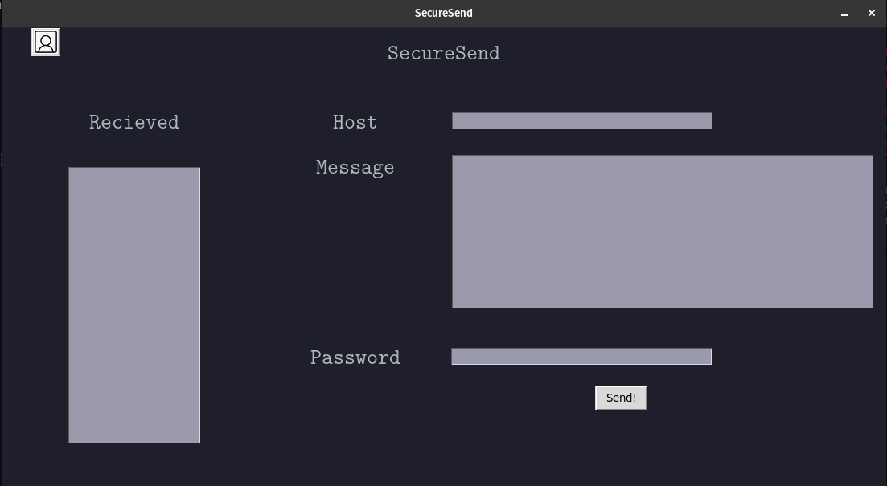

**SecureSend**\
SecureSend is an application that encrypts a message into an image using stenography and it zips that image with a password given by the sender that the receiver is already aware of.

**Working**\
This is the initial screen seen by the user when we execute the initial file with

    python3 main.py

