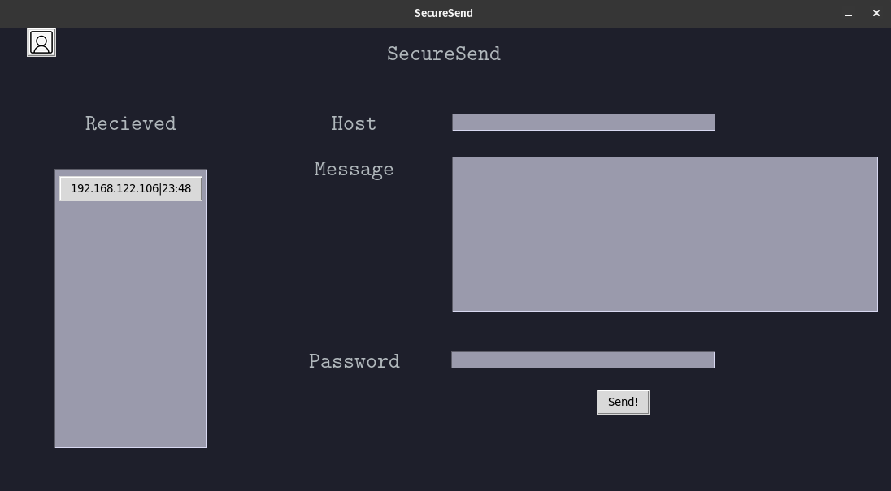

**SecureSend**
SecureSend is an application that encrypts a message into an image using stenography and it zips that image with a password given by the sender that the receiver is already aware of.

**Working**
This is the initial screen seen by the user when we execute the initial file with

    python3 main.py

To send messages we can type in the IP address of the recipient(will add host name in the future), we can get our current IP address by hovering over the user icon at the top left.
 

When all the fields are filled in and the program is sent, on the side bar to the left the IP address of the composer and the time is shown
 

